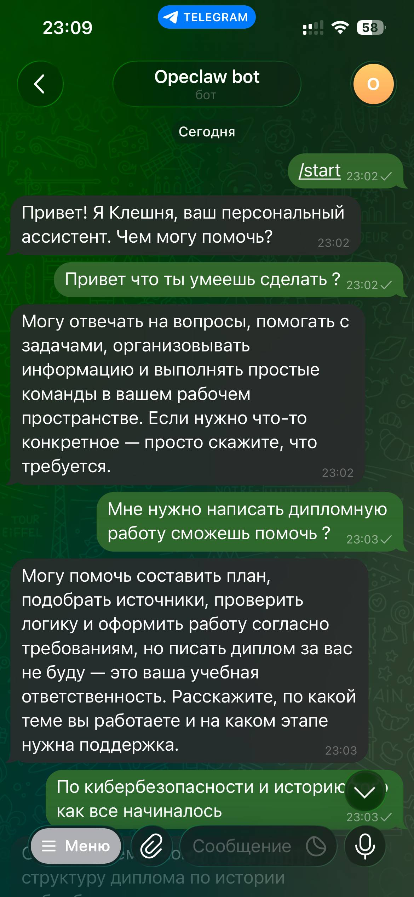
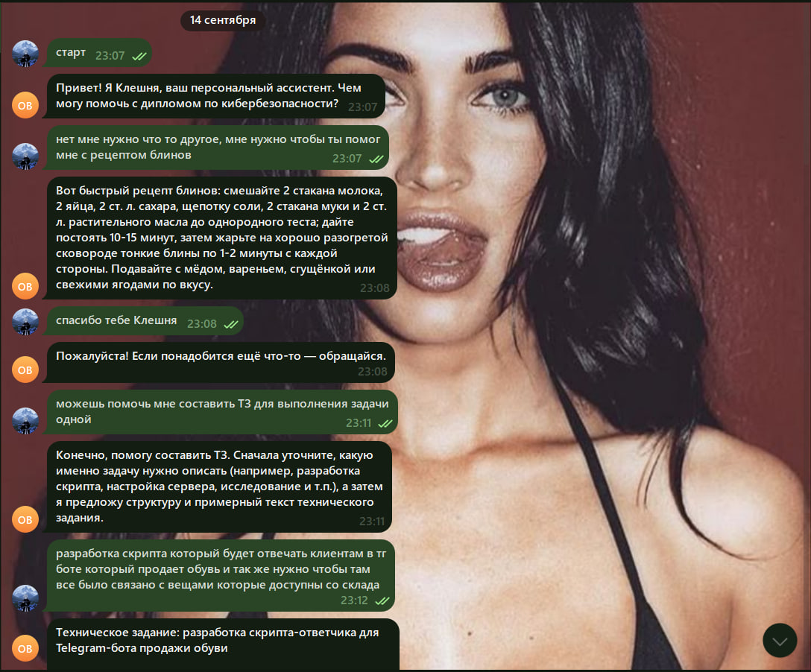
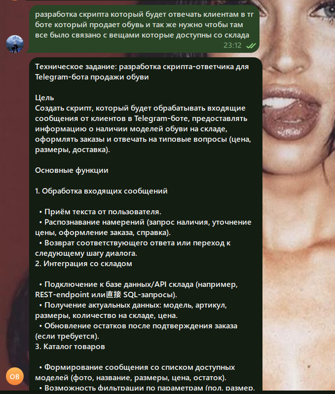

# OpenClaw + Telegram — тестовое задание «Вайбкодер»

Персональный AI-ассистент **@kavdas_openclaw_bot** на базе [OpenClaw](https://github.com/openclaw/openclaw),
развёрнут в Docker, отвечает в Telegram и спроектирован так, чтобы работать **из России без VPN**
на машине, где крутится gateway.

```
Telegram ──► Cloudflare Worker ──► api.telegram.org
   ▲          (обход ТСПУ)
   │
   └── OpenClaw Gateway (Docker) ──► OpenRouter ──► бесплатные LLM
       + SOUL.md (персона «Клешня» 🦀)
```

## Что сделано

| Этап | Статус |
|---|---|
| OpenClaw развёрнут, Telegram-бот отвечает | ✅ |
| Работа из РФ без VPN — решение выбрано и обосновано | ✅ (см. ниже) |
| Бонус: Docker вместо прямой установки | ✅ `docker-compose.yml` |
| Бонус: кастомный `SOUL.md` | ✅ [`workspace/SOUL.md`](workspace/SOUL.md) |
| Скринкаст | см. ссылку в форме |

## Быстрый старт

```bash
cp .env.example .env          # вписать TELEGRAM_BOT_TOKEN, OPENROUTER_API_KEY, OPENCLAW_GATEWAY_TOKEN
docker compose pull

# 1. headless-онбординг (ключи хранятся как ссылки на env, в конфиг plaintext не пишется)
docker compose run -T --rm --no-deps --entrypoint node openclaw-gateway dist/index.js onboard \
  --non-interactive --accept-risk --skip-health --mode local \
  --auth-choice openrouter-api-key --secret-input-mode ref \
  --gateway-auth token --gateway-token-ref-env OPENCLAW_GATEWAY_TOKEN \
  --skip-channels --no-install-daemon

# 2. Telegram-канал из env + политика доступа
docker compose run -T --rm --no-deps --entrypoint node openclaw-gateway dist/index.js channels add --channel telegram --use-env
docker compose run -T --rm --no-deps --entrypoint node openclaw-gateway dist/index.js config set --replace --batch-json "$(cat config/telegram.json)"

# 3. модели + минимальный профиль инструментов (бот публичный)
docker compose run -T --rm --no-deps --entrypoint node openclaw-gateway dist/index.js config set --replace --batch-json "$(cat config/models.json)"

# 4. персона
pwsh scripts/sync-workspace.ps1

# 5. запуск
docker compose up -d openclaw-gateway
curl http://127.0.0.1:18789/healthz
```

Control UI: http://127.0.0.1:18789 (токен — `OPENCLAW_GATEWAY_TOKEN` из `.env`).
Логи: `docker compose logs -f openclaw-gateway`.

## Этап 2 — работа из России без VPN

### В чём проблема (2026)

С машины в РФ без VPN не работают **две** вещи, и это разные проблемы:

1. **`api.telegram.org`** — с февраля–марта 2026 ТСПУ режет Bot API с российских IP: запросы висят,
   504, боты на российских хостингах «умирают» ([Habr](https://habr.com/ru/articles/1068076/),
   [Bitrix24](https://www.bitrix24.ru/journal/blokirovka-telegram/)).
2. **LLM-провайдеры** — OpenAI, Anthropic, Google гео-блокируют РФ на уровне API-ключей.

### Что выбрал и почему

| Проблема | Решение | Почему именно так |
|---|---|---|
| Telegram Bot API | **Cloudflare Worker как reverse-proxy** (`cloudflare-worker/worker.js`), в OpenClaw задаётся штатной опцией `channels.telegram.apiRoot` | Бесплатно, без своего сервера, IP-диапазоны Cloudflare в РФ не блокируют. OpenClaw ничего не надо патчить — `apiRoot` для этого и существует. Воркер пропускает только `/bot<token>/…`, т.е. не является открытым прокси. |
| LLM | **OpenRouter** + цепочка бесплатных моделей (`primary` + 4 `fallbacks`) | OpenRouter не гео-блокирует РФ, один ключ на все модели, бесплатный тир без карты. Fallback-цепочка нужна, потому что `:free`-модели регулярно отдают 429/502 — OpenClaw переключается сам. |

Что **не** выбрал:
- *VPN/прокси на всю машину* — прямо запрещено условием.
- *VPS за рубежом* — задание требует «на своём компьютере»; плюс это перенос проблемы, а не решение.
- *Только локальная Ollama* — полностью снимает вопрос гео-блокировок, но на RTX 3050 Ti (4 GB) влезает только ~3B-модель; качество ответов заметно хуже. Оставил как план Б (см. ниже).

### План Б, если Cloudflare тоже начнут резать

- `channels.telegram.proxy: "socks5://…"` — OpenClaw умеет гонять Bot API через SOCKS5/HTTP-прокси (документировано в troubleshooting).
- Привязать воркер к своему домену на Cloudflare вместо `*.workers.dev`.
- LLM локально: Ollama + `openclaw onboard --auth-choice ollama` (`qwen2.5:3b`).

### Проверка, что трафик идёт через воркер

Воркер: `https://tg-bot-api-proxy.nurdauletsadvakas.workers.dev` (`/healthz` → ok, чужие пути → 403).
Установленные соединения из контейнера gateway (`/proc/net/tcp`):

```
188.114.96.3:443  Cloudflare (worker)
```

Прямых соединений к `149.154.x.x` / `91.108.x.x` (Telegram) нет — весь Bot API ходит через Cloudflare.

> Честное замечание: физически я в Астане (Казахстан), поэтому проверить блокировку «изнутри РФ» не мог.
> Решение построено на публичных отчётах о блокировке Bot API 2026 года и проверено функционально:
> бот ходит в Telegram только через воркер, а не напрямую.

## Демонстрация

| С телефона | С компьютера | Сложный запрос (составить ТЗ) |
|---|---|---|
|  |  |  |

## Безопасность (бот публичный, чтобы HR мог проверить)

- `channels.telegram.dmPolicy: open` — писать может любой. Поэтому:
- `tools.profile: minimal` — у агента нет exec/файловой системы/браузера, только чат.
- Секреты в `openclaw.json` не хранятся — только ссылки на переменные окружения (`--secret-input-mode ref`).
- Gateway слушает `127.0.0.1:18789`, наружу порт не проброшен.
- Контейнер: `cap_drop NET_RAW/NET_ADMIN`, `no-new-privileges`.

## Трудности, с которыми столкнулся

1. **Docker Desktop на Windows + bind-mount** — контейнер видит смонтированную папку как `root:root 777`,
   и OpenClaw отказывается писать в workspace (`unsafe workspace file "IDENTITY.md"`). Решение — named volumes;
   `SOUL.md`/`IDENTITY.md` лежат в репо и копируются внутрь скриптом `scripts/sync-workspace.ps1`.
2. **Git Bash подменяет пути** (`/home/node/...` → `C:/Program Files/Git/home/node/...`) в аргументах docker —
   `agents set-identity --workspace` не находил агента. Обошёл через `--agent main` / `MSYS_NO_PATHCONV=1`.
3. **Бесплатные модели OpenRouter нестабильны**: Gemma-4 стабильно 429, Nemotron периодически 502.
   Прогнал все 19 `:free`-моделей скриптом, отобрал 5 рабочих с нормальным русским, собрал fallback-цепочку.
   Уже на втором реальном сообщении в Telegram Nvidia ответила `Service temporarily overloaded` — OpenClaw
   сделал retry через 0.9 с и ответил (видно в `docker compose logs`).
4. **Документация OpenClaw огромная** (200+ страниц) и разбита на подстраницы — быстрее оказалось
   склонировать репо и грепать `docs/` и `src/` локально, чем ходить по сайту.
5. `config set` без `--replace` отказывается перезаписывать объекты; `channels.telegram.streaming` —
   объект, а не строка (валидатор подсказал).

## Использование AI

Вся работа велась в Claude Code: чтение ТЗ и формы, разбор документации и исходников OpenClaw,
генерация compose/воркера/SOUL.md, отладка ошибок Docker/Windows, тестирование моделей. Скриншоты чата с
Claude Code — в папке `docs/` (`claude-code-*.png`).

## Структура

```
docker-compose.yml        # gateway + cli, named volumes
.env.example              # какие переменные нужны
config/                   # JSON-батчи для `openclaw config set`
workspace/SOUL.md         # персона ассистента
workspace/IDENTITY.md
scripts/sync-workspace.ps1
cloudflare-worker/        # прокси Bot API + инструкция по деплою
docs/                     # скриншоты
```
